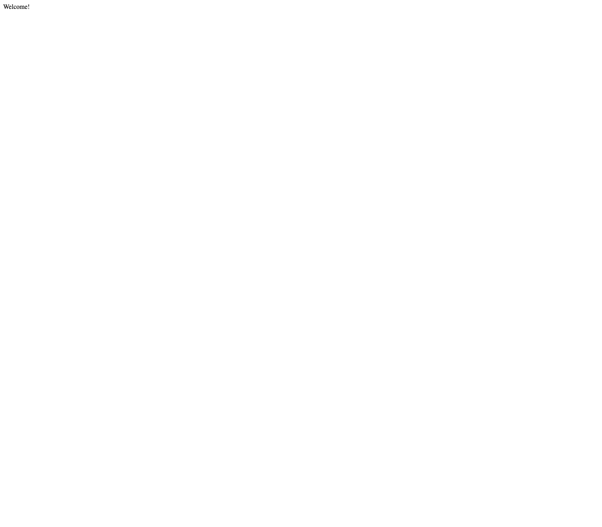

# Start development

## MacOS

Run once:

```
./initenv.bash
```

Run this at start of terminal:

```
source ./devenv.bash
```

# How to Use

## Store configuration

Create a `store-config.ts` file in the project directory:

```
import { AppStore } from "react-appevent-redux";
import * as Redux from "@reduxjs/toolkit";
import { RootAppState } from "./states/RootAppState";

function rootReducer(state: RootAppState | undefined, action: Redux.AnyAction) {
  return state ?? new RootAppState({});
}

export const reduxStore = Redux.configureStore({
  preloadedState: new RootAppState({}),
  reducer: AppStore.wrapReducer(rootReducer),
  middleware: (getDefaultMiddleware) =>
    // react-appevent-redux uses classes to represent states
    getDefaultMiddleware({
      serializableCheck: false,
    }),
});

export const appStore = new AppStore<RootAppState>({
  reduxStore: reduxStore,
});
```

## AppState Example

Create a `states` directory and create `states/RootAppState.ts`:

```
import { AppState, PartialProps } from "react-appevent-redux";
import { HomeAppState } from "./HomeAppState";

export class RootAppState extends AppState {
  home = new HomeAppState({});

  constructor(props: PartialProps<RootAppState>) {
    super();
    this.assignProps(props);
  }
}
```

Create `states/HomeAppState.ts`:

```
import { AppState, PartialProps } from "react-appevent-redux";

export class HomeAppState extends AppState {
  welcomeText = "Welcome!";
  constructor(props: PartialProps<HomeAppState>) {
    super();
    this.assignProps(props);
  }
}
```

## HomePage Example

Create a `connected-components` directory and `connected-components/HomePage.tsx`:

```
import React from "react";
import { connect } from "react-redux";
import { HomeAppState } from "../states/HomeAppState";
import { RootAppState } from "../states/RootAppState";

type _State = {
  };

  type _Props = {
    homeAppState: HomeAppState;
  };

  class _Home extends React.Component<_Props, _State> {
    constructor(props: _Props) {
      super(props);
      this.state = {};
    }

    render() {
      return (
        <React.Fragment>
            <div>{this.props.homeAppState.welcomeText}</div>
        </React.Fragment>
      );
    }
  }

  export const HomePage = connect<_Props, {}, {}, RootAppState>((rootAppState: RootAppState) => ({
    homeAppState: rootAppState.home,
  }))(_Home);
```

Add the `HomePage` component to `App.tsx`:

```
import { HomePage } from "./connected-components/HomePage";

function App() {
  return (
    <HomePage></HomePage>
  );
}

export default App;
```

Initialize redux in `index.tsx`:

```
import App from "./App";
import reportWebVitals from "./reportWebVitals";
import { Provider } from "react-redux";
import { reduxStore } from "./store-config";
import { createRoot } from 'react-dom/client';

const root = createRoot(document.getElementById('root')!);
root.render(
  <Provider store={reduxStore}>
      <App />
  </Provider>,
);

// If you want to start measuring performance in your app, pass a function
// to log results (for example: reportWebVitals(console.log))
// or send to an analytics endpoint. Learn more: https://bit.ly/CRA-vitals
reportWebVitals();
```

## Build Static Page

Run `npm start`:



# Handle Actions

## AppEvent Example

Create a `events` directory and `events/OnClickEvent.ts`L

```
import { HomeAppState } from "../states/HomeAppState";
import { RootAppState } from "../states/RootAppState";
import { AppEvent, AppEventStream, mapState, to } from "react-appevent-redux";

export class OnClickEvent extends AppEvent<RootAppState> {
    constructor() {
      super();
    }

  reducer(state: RootAppState): RootAppState {
      return state.mapState({
        home: (home: HomeAppState) => home.mapState({
          welcomeText: (currentText: string) => "Clicked!",
        }),
      });
  }

  /*
  Or, use mapState(...) and to(...) helpers
    to make it more concise:

  reducer = mapState<RootAppState>({
    home: mapState<HomeAppState>({
      welcomeText: to("Clicked!"),
    }),
  });
  */

  async *run(state: RootAppState): AppEventStream<RootAppState> {}
}
```

## Dispatch Event

Create a button in `HomePage.tsx` and when clicked, dispatch the `OnClickEvent`:

```
import React from "react";
import { connect } from "react-redux";
import { OnClickEvent } from "../events/OnClickEvent";
import { HomeAppState } from "../states/HomeAppState";
import { RootAppState } from "../states/RootAppState";
import { appStore } from "../store-config";

type _State = {
  };

  type _Props = {
    homeAppState: HomeAppState;
  };

  class _Home extends React.Component<_Props, _State> {
    constructor(props: _Props) {
      super(props);
      this.state = {};
    }

    render() {
      return (
        <React.Fragment>
            <div>{this.props.homeAppState.welcomeText}</div>
            <button onClick={() => appStore.dispatch(new OnClickEvent())}>Dispatch OnClickEvent</button>
        </React.Fragment>
      );
    }
  }

  export const HomePage = connect<_Props, {}, {}, RootAppState>((rootAppState: RootAppState) => ({
    homeAppState: rootAppState.home,
  }))(_Home);
```


